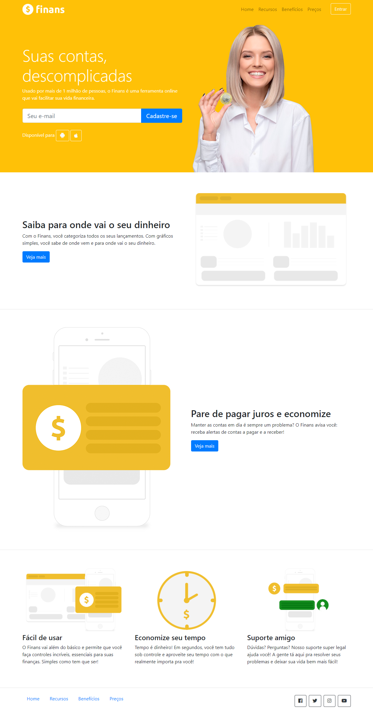

# Finans - Finanças Pessoais
> Projeto acadêmico.

Projeto acadêmico, escrito em HTML & estilizado com CSS3 (fazendo o uso do framework Bootstrap), se trata de um website para um app de finanças fictício.  

Projeto desenvolvido no curso de __Desenvolvimento web completo__, abordando as principais classes CSS do framework Bootstrap. 

## Meta

Paulo Marques - [@prmarquesz](https://twitter.com/prmarquesz) - paulormarques21@gmail.com

Udemy - [Curso de Desenvolvimento Web completo](https://www.udemy.com/course/web-completo/)